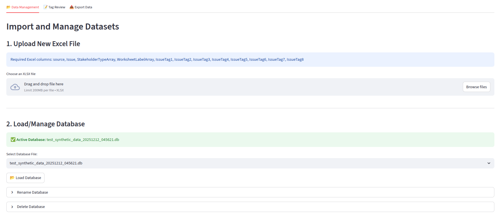

# Issue Tag Reviewer

Streamlit application to facilitate human review of key issue tags labelled by an LLM.

## Setup

This project uses `uv` Python package manager for dependency management. 
More info can be found here: https://docs.astral.sh/uv/getting-started/installation/

1.  **Install uv** (if not already installed):
    ```bash
    curl -LsSf https://astral.sh/uv/install.sh | sh
    ```

2.  **Clone Github repository**:
    ```bash
    git clone https://github.com/joe-zlu/llm_issue_tag_review_public.git
    ```
 
3.  **Create Python environment and sync dependencies**:
    Navigate to the project directory and sync dependencies:
    ```bash
    cd llm_issue_tag_review_public
    uv sync
    ```
    This will create a Python virtual environment and install the required dependencies specified in `pyproject.toml`.

## Deployment

To run the application locally:

```bash
streamlit run main.py
```

This will launch the Streamlit app in your default web browser.

## About

This application is designed to streamline the process of reviewing and verifying "Issue Tags" assigned to data records by a Large Language Model (LLM). It allows users to:

*   Upload Excel datasets containing LLM-tagged records.
*   Filter and navigate through records.
*   Compare proposed LLM tags against a standard list of predefined tags.
*   Confirm or modify tags and add review notes.
*   Export the reviewed data for downstream use.

## Usage

### 1. Data Management (Tab 1)

*   **Upload New Excel File**:
    *   Click "Browse files" to upload your `.xlsx` file.
    *   **Required Columns**: The Excel file must contain the following headers:
        *   `source`
        *   `Issue`
        *   `StakeholderTypeArray`
        *   `WorksheetLabelArray`
        *   `IssueTag1` through `IssueTag8` (columns for the proposed LLM tags)
    *   Select the worksheet to import.
    *   Click **"Import to Database"**. This converts the Excel file into a local SQLite database for processing.

*   **Load/Manage Database**:
    *   Select an existing database file from the dropdown.
    *   Click **"📂 Load Database"** to make it active.
    *   You can also rename or delete database files from this section.

### 2. Tag Review (Tab 2)

Once a database is loaded, use this tab to review records.

*   **Filters**: Use the "Filter by Source" and "Filter by Worksheet Label" dropdowns to narrow down the records you want to review.
*   **Navigation**:
    *   Use **Previous** / **Next** buttons to move through records one by one.
    *   Use **Next Unreviewed** to jump to the next record that hasn't been reviewed yet.
*   **Review Interface**:
    *   **Issue**: Displays the text of the issue being reviewed.
    *   **1. LLM Tags for Review**: Shows tags proposed by the LLM. You can add or remove tags using the multiselect box.
        *   Click **"Confirm Tags >>"** to save your selection.
    *   **2. Database: Reviewed Tags**: Shows the currently saved confirmed tags.
    *   **Tagging Notes**: Optional text area to add notes about the review decision. Click "Save Notes" to persist them.

### 3. Export Data (Tab 3)

*   Filter the data you wish to export (Source/Label).
*   **Option 1: Download CSV**: Exports a simplified CSV containing the Source, Label, Proposed Tags, Reviewed Tags, and Notes.
*   **Option 2: Download Excel**: Exports the full dataset, including original columns and review data, as an `.xlsx` file.

## Screenshots

### Tab 1: Data Management

### Tab 2: Tag Review

### Tab 3: Export Data  

